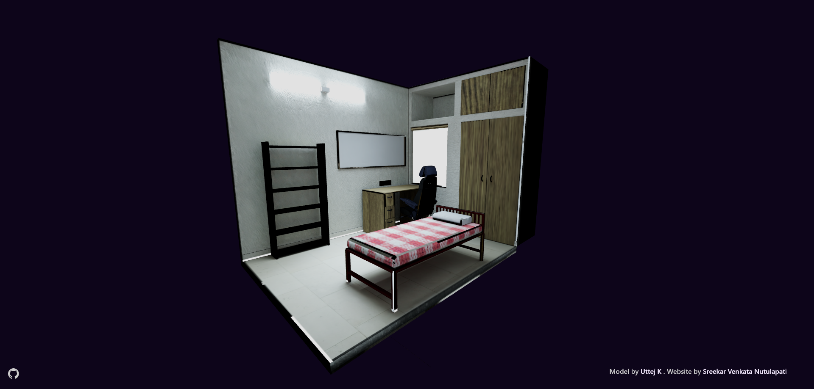

# Room 3D

Built with React and React Three Fibre (Three JS). Blender model by [Uttej K](https://uttejk.github.io/).

 

 

## Getting Started

Make sure you have [Node](https://nodejs.org/en) and [Yarn](https://yarnpkg.com/) installed on your PC.

1. Clone the repository

        git clone https://github.com/sreekarnv/room-3d.git

2. Install Dependencies
    
        yarn install

3. Start Development Server - (App will start on port 3000)
    
        yarn dev
